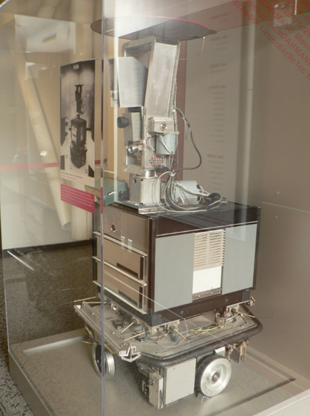
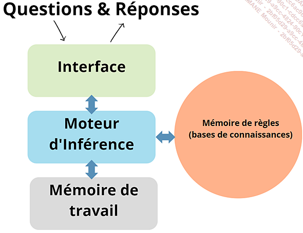

# Introduction a l'IA

L'histoire de l'intelligence débute peu après la seconde guerre mondiale... Et ce terme apparait pour la première fois en 1956 lors d'une conférence à Dartmouth College.

Les premiers travaux d'IA consistaient a creer des programmes dont le but etait de prouver des theoremes mathematiques.
Et c'est dans les années 60 que le prmier chatbot fu crée, le robot Shakey.

<u>Le robot Shakey</u>

Shakey, fut principalement utilisé pour tester des algorithmes de planification et de raisonnement et des taches simples en laboratioire.

Des la fin des années des 60, on annonce que l'IA est sur le point de résoudre tous les problèmes de l'humanité.

## Les systemes experts

Prenons l'exemple d'un systeme expert chargé de realtion client:

- Relge 1 : si le client pose une question sur les horaires d'ouverture, alors on lui répondra les horaires d'ouverture.
- Regle 2: si le cient fait mention du terme "probleme", lui offir de l'aide en le redirigeant vers le service concerné.
- si le client demande un remboursement, lui demander son numero de commande.

Ces systemes experts sont basés sur des regles de logique et de raisonnement.

Voici le schéma de fonctionnement d'un systeme expert:

On arrive avec ce genre de systeme vers des projets comme Deep Blue qui a battu le champion du monde d'echec en 1997.

## Les dates clés de l'IA :

1950 : Alan Turing publie son essai "Computing Machinery and Intelligence", posant ainsi les fondements du débat sur la capacité des machines à penser, et introduisant le célèbre Test de Turing.

1956 : la conférence de Dartmouth College marque le point de départ officiel de la recherche en intelligence artificielle en tant que discipline distincte.

1959 : Allen Newell et Herbert A. Simon développent Logic Theorist, un programme pionnier dans le domaine de l’intelligence artificielle.

1966 : Joseph Weizenbaum crée ELIZA, un programme de traitement du langage naturel simulant des conversations avec un psychothérapeute.

1969 : Terry Winograd conçoit SHRDLU, un programme démontrant la capacité d’une machine à comprendre et manipuler des objets dans un environnement virtuel.

Années 1980 : l’intelligence artificielle traverse une période de ralentissement, caractérisée par un financement limité et un intérêt en baisse de la part du public et des médias en raison de résultats décevants.

1997 : le superordinateur Deep Blue d’IBM bat le champion du monde d’échecs Garry Kasparov, marquant un tournant dans la perception de l’IA.

2001 : le film A.I. Intelligence Artificielle de Steven Spielberg explore les implications émotionnelles de l’intelligence artificielle.

2011 : le programme IBM Watson remporte le jeu télévisé Jeopardy !, démontrant des compétences en traitement du langage naturel et en recherche d’informations.

2012 : l’algorithme de deep learning AlexNet remporte le défi ImageNet, inaugurant l’utilisation généralisée des réseaux neuronaux profonds en vision par ordinateur.

2014 : Facebook développe DeepFace, un système d’IA capable d’une reconnaissance faciale humaine de haute précision.

2016 : le programme AlphaGo, créé par DeepMind (filiale de Google), défait le champion mondial du jeu de go, marquant un progrès majeur dans la résolution de problèmes complexes.

2017 : l’avènement des réseaux neuronaux génératifs (GAN) permet la création d’images et de contenus authentiques.

2018 : la société OpenAI dévoile GPT (Generative Pre-trained Transformer), représentant un saut en avant dans le traitement du langage naturel.

2019 : DeepMind lance AlphaStar, une IA surpassant des joueurs humains professionnels à StarCraft II.

2020 : OpenAI présente GPT-3, la dernière itération de la série, dotée de compétences de traitement du langage naturel encore plus avancées.

2021 : la Chine lance le projet "Made in China 2025", prévoyant d’importants investissements dans l’IA.

2021 : la FDA (Food and Drug Administration, l’agence nationale du médicament américain) approuve le premier système d’IA pour l’imagerie médicale, capable d’aider au diagnostic du cancer du sein.

## L'IA Generative

L’intelligence artificielle a évolué bien au-delà de simples programmes exécutant des tâches prédictibles. L’une des avancées les plus intrigantes et captivantes de l’IA est sa capacité à créer, à imaginer et à générer des contenus originaux. Cette facette fascinante est appelée : « IA générative ».

L’IA générative ouvre de fait de nouvelles perspectives dans l’innovation, dans l’art, dans le divertissement et même dans la résolution de problèmes complexes.

Elle repose sur des réseaux neuronaux d’apprentissage profond, tels que les réseaux génératifs adverses, en français, que vous retrouverez également en anglais sous son acronyme GAN (Generative Adversarial Networks), ainsi que les Transformers que nous aborderons au fur et à mesure dans cet ouvrage. Ces réseaux sont entraînés à partir d’énormes volumes de données et une fois entraînés, ils peuvent générer des données nouvelles et originales qui ressemblent à celles sur lesquelles ils ont été formés.

L’IA générative peut également créer des images réalistes, des compositions musicales et même des textes cohérents. Les GAN (réseaux génératifs adverses) sont célèbres pour leur capacité à générer des images qui semblent être le produit d’un artiste humain, mais qui n’existent en réalité que dans le code informatique.

Les Transformers, quant à eux, sont excellents pour générer des morceaux de texte, qu’il s’agisse de poèmes, de scripts de films ou d’articles de blog, nous y reviendrons tout au long du chapitre DALL-E : exploiter la créativité de l’IA.

Avec tout cela, notre IA dite générative dispose de champs d’applications vastes et variés. Dans le monde de l’art, elle peut créer des œuvres visuelles et musicales inédites, ouvrant de nouvelles voies créatives pour les artistes et vraisemblablement de nouveaux métiers... Dans le domaine du divertissement, elle peut, par exemple être utilisée pour générer des personnages et des scénarios pour les jeux vidéo. Enfin, dans la conception de produits, l’IA générative peut proposer des concepts innovants en fonction des critères émis en entrée.

L’IA générative ne doit pas être perçue comme une menace pour la créativité humaine, mais plutôt comme un outil collaboratif, parfois même un assistant. Les artistes peuvent utiliser l’IA comme source d’inspiration ou de génération de concepts originaux, avant d’ajouter une touche un peu plus personnelle. Cette combinaison de l’intelligence humaine et artificielle devrait aboutir à des œuvres innovantes et stimulantes qui révolutionneront bon nombre d’industries.

En comprenant le potentiel et les limites de l’IA générative, nous pouvons dès à présent explorer comment elle transforme notre compréhension de la créativité, redéfinissant ce que signifie être un artiste et comment les machines peuvent participer à l’acte créatif. L’IA générative n’est pas simplement une manifestation technologique, mais un tremplin pour de nouvelles idées et de nouvelles perspectives dans le monde de la création qui est finalement infini.
