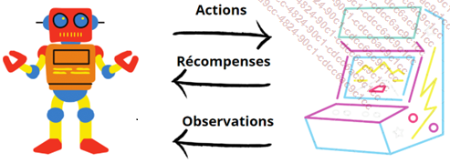
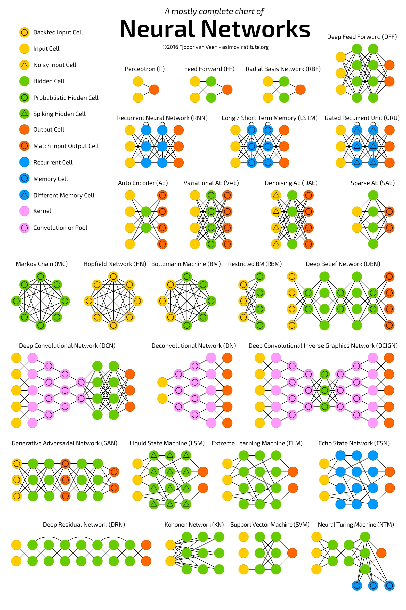
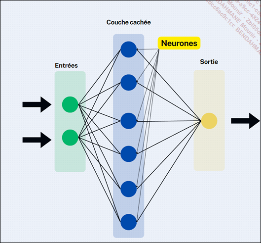
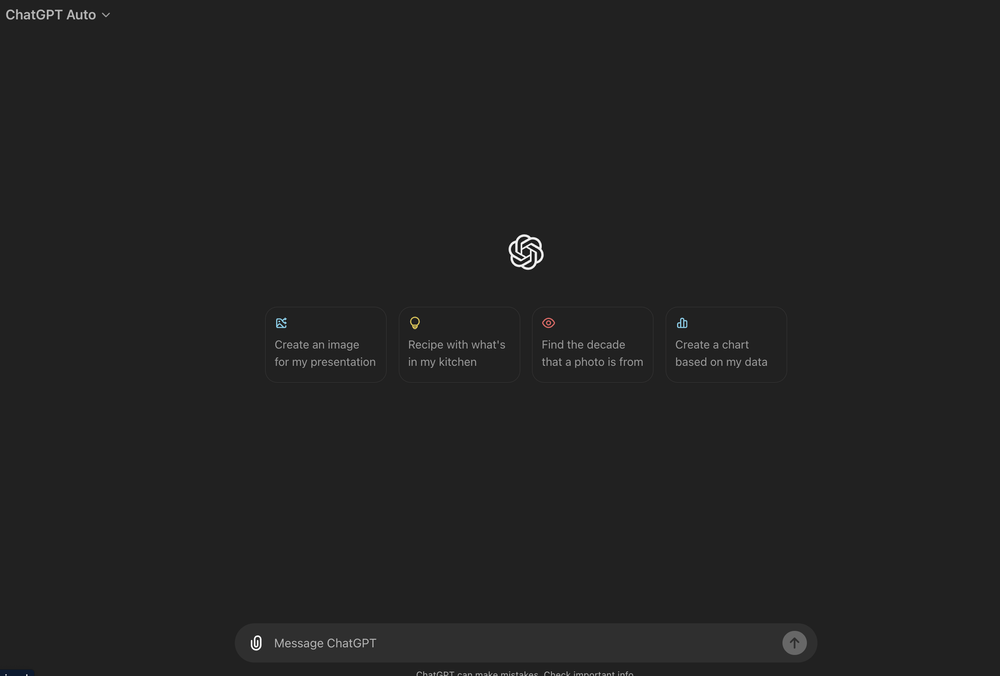

# Introduction a l'IA

L'histoire de l'intelligence débute peu après la seconde guerre mondiale... Et ce terme apparait pour la première fois en 1956 lors d'une conférence à Dartmouth College.

Les premiers travaux d'IA consistaient a creer des programmes dont le but etait de prouver des theoremes mathematiques.
Et c'est dans les années 60 que le prmier chatbot fu crée, le robot Shakey.

<u>Le robot Shakey</u>

Shakey, fut principalement utilisé pour tester des algorithmes de planification et de raisonnement et des taches simples en laboratioire.

Des la fin des années des 60, on annonce que l'IA est sur le point de résoudre tous les problèmes de l'humanité.

## Les systemes experts

Prenons l'exemple d'un systeme expert chargé de realtion client:

- Relge 1 : si le client pose une question sur les horaires d'ouverture, alors on lui répondra les horaires d'ouverture.
- Regle 2: si le cient fait mention du terme "probleme", lui offir de l'aide en le redirigeant vers le service concerné.
- si le client demande un remboursement, lui demander son numero de commande.

Ces systemes experts sont basés sur des regles de logique et de raisonnement.

Voici le schéma de fonctionnement d'un systeme expert:

On arrive avec ce genre de systeme vers des projets comme Deep Blue qui a battu le champion du monde d'echec en 1997.

## Les dates clés de l'IA :

1950 : Alan Turing publie son essai "Computing Machinery and Intelligence", posant ainsi les fondements du débat sur la capacité des machines à penser, et introduisant le célèbre Test de Turing.

1956 : la conférence de Dartmouth College marque le point de départ officiel de la recherche en intelligence artificielle en tant que discipline distincte.

1959 : Allen Newell et Herbert A. Simon développent Logic Theorist, un programme pionnier dans le domaine de l’intelligence artificielle.

1966 : Joseph Weizenbaum crée ELIZA, un programme de traitement du langage naturel simulant des conversations avec un psychothérapeute.

1969 : Terry Winograd conçoit SHRDLU, un programme démontrant la capacité d’une machine à comprendre et manipuler des objets dans un environnement virtuel.

Années 1980 : l’intelligence artificielle traverse une période de ralentissement, caractérisée par un financement limité et un intérêt en baisse de la part du public et des médias en raison de résultats décevants.

1997 : le superordinateur Deep Blue d’IBM bat le champion du monde d’échecs Garry Kasparov, marquant un tournant dans la perception de l’IA.

2001 : le film A.I. Intelligence Artificielle de Steven Spielberg explore les implications émotionnelles de l’intelligence artificielle.

2011 : le programme IBM Watson remporte le jeu télévisé Jeopardy !, démontrant des compétences en traitement du langage naturel et en recherche d’informations.

2012 : l’algorithme de deep learning AlexNet remporte le défi ImageNet, inaugurant l’utilisation généralisée des réseaux neuronaux profonds en vision par ordinateur.

2014 : Facebook développe DeepFace, un système d’IA capable d’une reconnaissance faciale humaine de haute précision.

2016 : le programme AlphaGo, créé par DeepMind (filiale de Google), défait le champion mondial du jeu de go, marquant un progrès majeur dans la résolution de problèmes complexes.

2017 : l’avènement des réseaux neuronaux génératifs (GAN) permet la création d’images et de contenus authentiques.

2018 : la société OpenAI dévoile GPT (Generative Pre-trained Transformer), représentant un saut en avant dans le traitement du langage naturel.

2019 : DeepMind lance AlphaStar, une IA surpassant des joueurs humains professionnels à StarCraft II.

2020 : OpenAI présente GPT-3, la dernière itération de la série, dotée de compétences de traitement du langage naturel encore plus avancées.

2021 : la Chine lance le projet "Made in China 2025", prévoyant d’importants investissements dans l’IA.

2021 : la FDA (Food and Drug Administration, l’agence nationale du médicament américain) approuve le premier système d’IA pour l’imagerie médicale, capable d’aider au diagnostic du cancer du sein.

## L'IA Generative

L’intelligence artificielle a évolué bien au-delà de simples programmes exécutant des tâches prédictibles. L’une des avancées les plus intrigantes et captivantes de l’IA est sa capacité à créer, à imaginer et à générer des contenus originaux. Cette facette fascinante est appelée : « IA générative ».

L’IA générative ouvre de fait de nouvelles perspectives dans l’innovation, dans l’art, dans le divertissement et même dans la résolution de problèmes complexes.

Elle repose sur des réseaux neuronaux d’apprentissage profond, tels que les réseaux génératifs adverses, en français, que vous retrouverez également en anglais sous son acronyme GAN (Generative Adversarial Networks), ainsi que les Transformers que nous aborderons au fur et à mesure dans cet ouvrage. Ces réseaux sont entraînés à partir d’énormes volumes de données et une fois entraînés, ils peuvent générer des données nouvelles et originales qui ressemblent à celles sur lesquelles ils ont été formés.

L’IA générative peut également créer des images réalistes, des compositions musicales et même des textes cohérents. Les GAN (réseaux génératifs adverses) sont célèbres pour leur capacité à générer des images qui semblent être le produit d’un artiste humain, mais qui n’existent en réalité que dans le code informatique.

Les Transformers, quant à eux, sont excellents pour générer des morceaux de texte, qu’il s’agisse de poèmes, de scripts de films ou d’articles de blog, nous y reviendrons tout au long du chapitre DALL-E : exploiter la créativité de l’IA.

Avec tout cela, notre IA dite générative dispose de champs d’applications vastes et variés. Dans le monde de l’art, elle peut créer des œuvres visuelles et musicales inédites, ouvrant de nouvelles voies créatives pour les artistes et vraisemblablement de nouveaux métiers... Dans le domaine du divertissement, elle peut, par exemple être utilisée pour générer des personnages et des scénarios pour les jeux vidéo. Enfin, dans la conception de produits, l’IA générative peut proposer des concepts innovants en fonction des critères émis en entrée.

L’IA générative ne doit pas être perçue comme une menace pour la créativité humaine, mais plutôt comme un outil collaboratif, parfois même un assistant. Les artistes peuvent utiliser l’IA comme source d’inspiration ou de génération de concepts originaux, avant d’ajouter une touche un peu plus personnelle. Cette combinaison de l’intelligence humaine et artificielle devrait aboutir à des œuvres innovantes et stimulantes qui révolutionneront bon nombre d’industries.

En comprenant le potentiel et les limites de l’IA générative, nous pouvons dès à présent explorer comment elle transforme notre compréhension de la créativité, redéfinissant ce que signifie être un artiste et comment les machines peuvent participer à l’acte créatif. L’IA générative n’est pas simplement une manifestation technologique, mais un tremplin pour de nouvelles idées et de nouvelles perspectives dans le monde de la création qui est finalement infini.

## Classification des IA

La classification de l’intelligence artificielle a pour vocation de permettre la compréhension des différentes catégories de systèmes développés dans ce domaine. Nous vous proposons ci-dessous les quatre domaines de classification dont vous devez avoir connaissance.

### L'intelligence artificielle faible

L’IA faible, également connue sous les noms et acronymes : « d’IA étroite », de « Narrow Ai » ou bien encore « ANI », fait référence à des systèmes préalablement conçus dans le but de mener à bien une tâche précise et de manière intelligente. Elle est en fait considérée comme étant monotâche. L’IA faible se définie par la simulation d’un comportement humain, tout autant que par la restriction qu’on lui impose avec des contraintes se limitant à la tâche à accomplir. Elle est tout bonnement experte en son domaine de prédilection.

Malgré leurs apparences, ces systèmes sont donc plutôt limités dans leurs capacités et ne peuvent pas généraliser leur apprentissage à d’autres domaines.

Quelques exemples courants d’IA faible :

- les systèmes de recommandation ;

- les **Chatbots** ;

- les moteurs de recherche ;

- les voitures à conduite autonome ;

- les outils de cartographie ;

- les assistants virtuels ;

- les systèmes de reconnaissance faciale ;

- Siri, l’assistant virtuel Apple.

Comprenez par là, qu’une l’IA faible est orientée vers un objectif unique, bien précis, consistant à accomplir des tâches dédiées et spécifiques.

### L'intelligence artificielle forte

Cette dernière est aussi connue sous les noms et acronymes de IA profonde, ou en anglais AGI pour Artificial General Intelligence. À la différence de l’IA faible, l’IA forte vise à imiter l’intelligence humaine à tous les niveaux.

Ces systèmes sont capables de comprendre, d’apprendre, de raisonner et d’effectuer des tâches complexes de manière similaire à un être humain. L’idée ici, c’est de développer tout un système d’apprentissage (capacité cognitive) permettant à la machine de s’améliorer continuellement et d’apprendre de ses erreurs en permanence. Elle est en quelque sorte supposée apporter une réponse à tout type de problème.

Quelques exemples courants d’IA forte :

- La cybersécurité en déjouant des attaques toujours nouvelles sur des failles auparavant jamais exploitées.

- La prédiction des comportements ou comment anticiper les mouvements boursiers ou bien encore météorologiques.

- La programmation informatique.

- La vérification de faits.

Nous allons sous doute vous décevoir, mais l’IA forte est encore à ce jour, un objectif à moyen/long terme. La communauté de chercheur n’a pas encore pu pleinement atteindre cet objectif en concevant une intelligence artificielle forte, consciente et robuste. Pour atteindre ce plafond de verre, le défi réside dans la nécessité de permettre aux machines de bénéficier d’une conscience leur octroyant la possibilité de discerner les émotions et les croyances humaines.

Cela suscite encore, à date, de bien nombreux débats sur ses implications éthiques et philosophiques de nos futurs systèmes.

### L'I.A. symbolique

Cette troisième typologie d’IA repose sur la manipulation de symboles lisibles par l’homme pour représenter leurs propres comportements et expertises.

C’est en fait un mécanisme d’abstraction qui repose sur des faits et règles et représentant des connaissances expertes. Cela ne vous rappelle rien ?

Ces systèmes utilisent des bases de connaissances structurées et des algorithmes de raisonnement pour représenter la connaissance et prendre des décisions que l’on pourrait penser intelligentes. L’IA symbolique a ainsi été largement utilisée dans les systèmes experts, qui sont conçus pour résoudre des problèmes spécifiques dans des domaines tels que la médecine, le droit et l’ingénierie.

Quelques exemples courants d’IA symbolique :

- les systèmes experts ;

- les systèmes à base de règles précises ;

- les systèmes à base de connaissances.

### L'I.A. connexionniste

Quatrième domaine de classification, l’intelligence artificielle dite connexionniste qui est également connue sous le nom de réseaux de neurones artificiels.

Sa source d’inspiration n’est rien d’autre, soyons modestes que le fonctionnement du cerveau humain. Elle vise essentiellement à reproduire des phénomènes mentaux ce qui n’est pas le cas de l’IA symbolique que nous avons pu voir précédemment.

Ces systèmes utilisent des réseaux de neurones que l’on dit interconnectés pour effectuer des tâches d’apprentissage et de reconnaissance.

Techniquement ces réseaux de neurones artificiels sont constitués de nœuds appelés neurones qui sont reliés entre eux par des connexions pondérées (synapses) qui permettent aux signaux d’être transmis à travers le réseau.

Chaque neurone reçoit des signaux d’entrée, effectue des calculs sur ces signaux et transmet un signal de sortie aux neurones suivants. L’apprentissage des réseaux de neurones se fait par ajustement des poids des connexions, permettant ainsi au réseau de s’adapter aux données et de générer des prédictions ou des classifications précises.

Les réseaux de neurones sont fréquemment employés dans des domaines tels que le traitement du langage naturel (NLP ou Natural Language Processing en anglais), la vision par ordinateur (OCR ou Optical Character Recognition en anglais), et la reconnaissance vocale. Ces sujets seront abordés dès le chapitre Les applications de l’IA de cet ouvrage.

Les réseaux de neurones sont largement utilisés dans des domaines tels que le traitement du langage naturel (NLP ou Natural Language Processing), la vision par ordinateur (OCR ou Optical Character Recognition) et la reconnaissance vocale que nous aborderons plus tard dans cet ouvrage.

## Les modèles de l'IA et le machine learning

Les modèles d'IA :

Nous allons explorer les différents modèles d’intelligence artificielle, à commencer par le machine learning (ML) et ses <s>algorithmes</s>, véritable pierre angulaire de l’IA.

Nous aborderons ensuite le traitement du langage naturel (NLP) offrant à nos machines la capacité à comprendre le langage humain avant d’aborder le « deep learning » (DL) et la Vision par Ordinateur.

### L'apprentissage automatique (Machine Learning)

Le machine learning, abrégé ML, représente l’une des branches les plus captivantes de l’intelligence artificielle, un sujet qui pourrait remplir un livre entier à lui seul. Cette approche technologique révolutionnaire permet aux experts en données, communément appelés « Data Scientists », d’alimenter les algorithmes avec des ensembles de données, donnant ainsi aux machines la capacité d’apprendre et de prendre des décisions sans nécessiter de programmation informatique préalable.

En d’autres termes, au lieu de suivre des instructions strictes, les machines peuvent maintenant acquérir des connaissances à partir de données numériques préexistantes et s’améliorer au fil du temps grâce à un apprentissage continu et à l’augmentation du volume de données disponibles.

Le machine learning sert principalement à repérer des tendances et des similitudes, souvent désignées sous le terme de "patterns", qu’il s’agisse d’images, de mots, de statistiques, ou autres.

L’objectif sous-jacent est l’automatisation des tâches et la capacité à effectuer des prédictions en se basant sur des données passées.

Quelques exemples d’utilisation du ML :

- La santé : détection des maladies.

- Le secteur industriel : permettant de surveiller les capteurs et les défaillances.

- Le commerce : tendances de vente.

- Le tourisme : tarifications selon des tendances.

Nous aborderons trois termes que nous appellerons paradigmes d’apprentissage du machine learning :

- **L’Apprentissage Supervisé** (Supervised Learning).

- **L’Apprentissage Non-Supervisé** (Unsupervised Learning).

- **L’Apprentissage par Renforcement** (Reinforcement Learning).

<u>Figure: **Les grands paradigmes de l’apprentissage machine**</u>

### L'apprentissage supervisé

L’apprentissage supervisé est une approche visant à créer des modèles « prédictifs » pour anticiper par exemple, les besoins d’une entreprise. Dans ce contexte, la machine dispose déjà des réponses attendues, et notre rôle consiste à guider son acquisition de connaissances en lui fournissant des exemples de questions et de réponses.

Prenons un exemple concret afin d’illustrer le concept de l’apprentissage supervisé. Imaginons qu’un Data Scientist souhaite entraîner un algorithme à déterminer si une image contient un panda, un ours ou un pingouin. Dans le cadre de l’apprentissage supervisé, il attribue une « étiquette » à chaque image de l’ensemble de données d’entraînement, précisant si l’image contient l’un de ces animaux ou non.

<u>Figure: **L'apprentissage supervisé illustré**</u>

L’efficacité du modèle est évaluée en comparant ses prédictions avec les valeurs réelles, souvent en utilisant des métriques telles que l’exactitude, la précision, le rappel, etc.

### L'apprentissage non-supervisé

À l’instar de l’apprentissage supervisé, l’apprentissage non supervisé est entraîné sur des données qui ne disposent pas d’étiquette (un panda n’est pas un panda, un canard n’est pas encore un canard...). Notre modèle d’apprentissage va se baser cette fois-ci, sur des similitudes, en regroupant ces dernières par ensembles et sous-ensembles que nous appellerons « Clustering ».

<u>Figure: **L'apprentissage non-supervisé illustré**</u>

Le principe d’association est complémentaire au clustering, il dispose de la détection de probabilité, par exemple les animaux disposant d’un bec jaune portent régulièrement un chapeau. Il s’agit d’un phénomène de probabilité de co-occurrence permettant de créer de nouveaux grands groupes de données.

L’évaluation de l’apprentissage non supervisé peut être plus complexe, car il n’y a pas de réponses correctes prédéfinies.

### L'apprentissage par renforcement

<u>Figure: **L'apprentissage par renforcement illustré**</u>

Le Reinforcement Learning, ou apprentissage par renforcement, est une méthode de machine learning de plus en plus utilisée. Dans les faits, c’est comme si nous apprenions à un ordinateur à faire des choses en le récompensant quand il fait bien et en le punissant quand il fait mal. Cela pourrait être la clé pour créer une intelligence artificielle comparable à l’éducation de nos enfants.

Le Reinforcement Learning est une façon spécifique d’entraîner une intelligence artificielle. Imaginez que vous ayez un animal de compagnie, comme un chien. Vous ne pouvez pas lui expliquer avec des mots ce que vous voulez qu’il fasse, car il ne comprend pas le langage humain.

Au lieu de cela, vous créez des situations pour provoquer des réactions. Si le chien réagit correctement, vous le récompensez avec une friandise. Et bien si vous le permettez, l’IA dans le Reinforcement Learning est un peu comme ce chien.

Elle doit apprendre à accomplir une tâche dans un environnement incertain et parfois très compliqué. L’ordinateur essaie différentes actions et apprend de ses erreurs. Chaque fois qu’il essaie quelque chose, il reçoit une récompense ou une punition en fonction de ce qu’il fait. L’objectif de l’IA est de maximiser des récompenses, donc elle essaie de trouver la meilleure façon de le faire.

Il y a tout de même ici une subtilité à prendre en considération et pas des moindres puisqu’il n’y a pas de mode d’emploi pour l’IA. Personne ne lui dit comment accomplir la tâche. Elle doit le découvrir elle-même, en commençant par des essais totalement aléatoires jusqu’à développer des stratégies, disons-le très sophistiquées.

Aujourd’hui, le Reinforcement Learning est l’une des meilleures façons de stimuler la créativité des machines. Contrairement à un être humain, une IA peut effectuer des milliers de tentatives simultanées grâce à une puissante infrastructure informatique.

<u>Figure: **L'apprentissage par renforcement illustré**</u>

### La detection d'anomalies

La détection d’anomalies est un domaine clé de la science des données visant à repérer des événements inhabituels ou des observations divergentes dans un ensemble de données. Ces occurrences peu communes peuvent varier en nature et toucher différents domaines, tels que les fraudes financières, les problèmes médicaux ou les intrusions dans les réseaux.

En machine learning, la détection d’anomalies constitue un problème unique qui peut être abordé de manière supervisée ou non supervisée. Dans une approche supervisée, il peut être traité comme une classification binaire, où l’objectif est de classer chaque observation comme étant une anomalie ou non. Ce défi se caractérise par le fait que les anomalies représentent une classe minoritaire, constituant souvent moins de 1 % de l’ensemble des données.

- Identification de fraudes financières : il est possible de repérer des opérations financières suspectes, comme l’utilisation non autorisée de cartes de crédit ou des transactions inhabituelles sur un compte bancaire, en recourant à des algorithmes spécialisés dans la détection d’anomalies.

- Sécurité informatique : la cybercriminalité, y compris les attaques de piratage et les logiciels malveillants, peut être décelée en surveillant les schémas de comportement atypiques au sein des systèmes informatiques.

- Maintenance industrielle en temps réel : dans le domaine manufacturier, la détection d’anomalies permet une surveillance en temps réel des machines et équipements industriels, permettant ainsi de prédire les pannes et d’éviter des arrêts de production onéreux.

- Identification de défauts de fabrication : dans la production de biens manufacturés, la détection d’anomalies sert à reconnaître les défauts ou produits défectueux en se basant sur des caractéristiques inusuelles.

- Détection de maladies médicales : en médecine, la détection d’anomalies est d’une grande utilité pour repérer des cas médicaux rares ou inhabituels qui requièrent une attention particulière, notamment dans l’interprétation d’images médicales ou de résultats d’analyses.

- Assurance qualité automatisée : l’inspection automatisée des produits au sein des chaînes de production fait usage d’algorithmes de détection d’anomalies pour identifier les articles non conformes aux normes de qualité.

- Surveillance environnementale anticipée : la détection d’anomalies peut servir à la surveillance des conditions environnementales, comme la qualité de l’air, la pollution de l’eau ou les activités sismiques, afin d’anticiper des événements inhabituels.

- Gestion des réseaux de transport : au sein des réseaux de transport, tels que les systèmes de métro, les algorithmes de détection d’anomalies peuvent signaler des dysfonctionnements ou des perturbations dans le fonctionnement du réseau.

- Maintenance préventive des équipements énergétiques : dans le secteur de l’énergie, les équipements tels que les turbines ou les générateurs peuvent être surveillés grâce à la détection d’anomalies pour prévenir les pannes et les dysfonctionnements.

### La represenation des donnees

La représentation des données est une étape fondamentale dans le processus de prétraitement des données, indépendamment de l’apprentissage supervisé ou non supervisé.

La représentation des données consiste à transformer les données brutes en une forme qui est plus adaptée à l’analyse ou à l’apprentissage automatique. Cette transformation peut inclure des étapes telles que la normalisation, la réduction de dimension, l’extraction de caractéristiques, ou la création de représentations vectorielles.

Dans les faits, la représentation des données est une étape préliminaire qui peut être utilisée dans des contextes supervisés ou non supervisés, selon les besoins de la tâche que vous effectuez. Elle vise généralement à simplifier et à rendre les données plus exploitables pour les algorithmes d’apprentissage ultérieurs, quel que soit leur type.

## NLP et traitement du langage naturel

La raison d’être du NLP consiste à permettre la compréhension et la manipulation du langage humain par nos machines, rien que ça !

Pour l’histoire, le NLP remonte aux balbutiements de l’informatique dans les années 1950, mais son développement significatif s’est accéléré ces dernières décennies grâce aux avancées technologiques de l’intelligence artificielle.

Les tout premiers travaux se concentraient à cette époque essentiellement sur la traduction automatique. Une décennie plus tard dans les années 60, de nouvelles approches sont apparues permettant notamment d’adjoindre des règles grammaticales à la traduction automatique.

### Les applications du NLP

La compréhension du langage naturel (NLU) constitue l’art de déchiffrer le sens caché au sein d’un texte ou d’une conversation, bien au-delà d’une simple traduction.

Dans le domaine de la NLU, de nombreuses techniques sont employées. Nous ne les aborderons pas dans le détail de ce chapitre, toutefois ces dernières sont principalement :

La segmentation du texte : activité de découpage.

L’identification des entités nommées : activité d’identification.

La démystification des ambiguïtés sémantiques : activité permettant de donner du sens pour les mots et expressions.

La mise en contexte des éléments textuels : activité de compréhension globale d’un texte.

Il existe deux approches du NLU :

NLU basé sur des règles : certains systèmes de NLU utilisent des règles et des modèles linguistiques prédéfinis pour interpréter le texte. Ces systèmes sont souvent conçus de manière experte pour des tâches spécifiques.

NLU en apprentissage automatique : de nombreuses solutions de NLU utilisent des modèles d’apprentissage automatique, tels que les réseaux neuronaux, pour entraîner des algorithmes à comprendre et à interpréter le langage naturel en utilisant des données d’entraînement. Ces modèles peuvent être adaptés à de nombreuses taches.

## Les applications de l'IA : CHATBOTS, creation de prompts, etc.

### **Chatbot**:

Les chatbots alimentés par l’IA sont des programmes informatiques capables de simuler une conversation humaine. Ils ne se contentent pas de répondre aux questions des utilisateurs, mais ils ont également la capacité de fournir des informations pour orienter les utilisateurs dans leurs interactions. Ce qui distingue l’intelligence artificielle, ce sont les algorithmes d’apprentissage automatique associés. Le machine learning leur permet de comprendre le sens de votre demande et de vous proposer la réponse la plus pertinente possible. De plus, il est possible d’interagir vocalement avec eux grâce aux techniques de reconnaissance de langage naturel (NLP), ce qui signifie que le chatbot peut comprendre votre voix et la convertir en texte.

## L'iA generative par OpenAI : ChatGPT (ou Gemini de Google!)

<u>Figure: **ChatGPT**</u>

### L'histoire de ChatGPT

L’histoire de ChatGPT trouve naturellement ses racines dans les progrès rapides de l’intelligence artificielle et du traitement du langage naturel au cours des dernières décennies. Rassurez-vous, nous n’allons pas refaire à nouveau l’histoire de l’intelligence artificielle abordée dans le tout premier chapitre de cet ouvrage mais allons plutôt ici cibler l’une des avancées majeures ayant propulsé le narratif de l’intelligence artificielle et particulièrement la mise en avant de ChatGPT sur le devant de la scène médiatique à la fin du mois de novembre 2022.

Afin de bien comprendre ce qu’est ChatGPT, vous devez comprendre ce qu’est GPT, acronyme de Generative Pre-trained Transformer.

GPT est ce que l’on appelle communément une « architecture de modèle de langage ». Premier élément à son sujet qui vous semblera peut-être surprenant, sachez que GPT a fait sa toute première apparition voici déjà plusieurs années, il y a plus d’une demi-décennie.

Le modèle GPT-1 a été déployé en 2018 par la société OpenAI. Il a initialement été conçu dans l’objectif de générer du texte cohérent et parfaitement fluide selon un contexte donné.

Ce modèle a montré la puissance de l’apprentissage profond en utilisant une architecture de réseau de neurones appelée « Transformer » pour générer du texte cohérent en fonction d’un contexte donné.

#### L'architecture Transformer

Arrêtons-nous à nouveau quelques instants sur cette architecture baptisée Transformer. Cette architecture de réseaux de neurones a été introduite et présentée pour la toute première fois en 2017 par Ashish Vaswani (https://en.wikipedia.org/wiki/Ashish_Vaswani) accompagné d’un groupe de chercheurs de renom.

L’article de recherche fut publié en leurs noms distincts : "Attention is All You Need" (https://proceedings.neurips.cc/paper_files/paper/2017/file/3f5ee243547dee91fbd053c1c4a845aa-Paper.pdf).

L'impact de cette publication a tout simplement bouleversé l’histoire de l’intelligence artificielle puisque ce modèle d’architecture « Transformer » est devenu la base de bien nombreux modèles NLP de pointe aujourd’hui déployée. Parmi les plus populaires, nous pouvons d’ailleurs citer les suivants :

- BERT (Bidirectional Encoder Representations from Transformers)

- RoBERTa (Robustly Optimized BERT Pretraining Approach)

- XLNet (eXtreme Language Model for Natural Language Tasks)

- Megatron-Turing NLG (MT-NLG)

L’une des particularités de l’architecture Transformer est qu’elle utilise un mécanisme d’auto-attention contrairement aux deux réseaux neuronaux cités précédemment (RNN et LSTM).

Le mécanisme d’auto-attention dispose de nombreuses particularités. Il offre tout d’abord la possibilité de traiter la séquence d’entrée en parallèle de nombreuses autres, permettant ainsi une meilleure évolutivité et un temps d’entraînement bien plus rapide. Dans les faits, sa capacité à effectuer des calculs en parallèle le rend bien plus rapide à l’entraînement par rapport aux modèles traditionnels à base de RNN.

Cela permet également une bien meilleure compréhension des relations entre les différents mots d’une phrase soumise.

L’architecture Transformer est composée de l’encodeur et du décodeur comme vous avez pu le découvrir dans le chapitre DALL-E : exploiter la créativité de l’IA. L’encodeur convertit l’entrée en représentations, tandis que le décodeur transforme ces représentations en sortie.

Nos deux amis encodeur et décodeur sont constitués de couches dites « attentionnelles ». Chaque couche calcule l’attention pour chaque mot, indiquant leur importance pour la sortie. Les couches attentionnelles sont ensuite répétées à de nombreuses reprises dans les deux parties, favorisant ainsi l’apprentissage des relations entre les mots.

<u>Figure: **L'architecture Transformer**</u>

En 2019, GPT-2 a été publié. Il est à noter que GPT-2 a été vivement apprécié par la communauté dès sa sortie pour ses capacités de génération de texte tout simplement réaliste et cohérent. Il a de fait été utilisé pour répondre aux sollicitations de l’humain de manière informative, mais également dans le but de créer du contenu de tout type tel que du code informatique, des e-mails, des poèmes, etc.

Notons cependant une particularité dans le déploiement de GPT2 : cette version fut publiée de façon limitée au grand public pour des problématiques d’éthique et d’utilisation abusive. Vous imaginez vraisemblablement les débats que cela a pu susciter déjà, à cette date, sur l’éthique des intelligences artificielles nouvellement créées.

Paradoxalement, cela a en fait renforcé l’engouement pour ces technologies et permis de créer de nouveaux métiers autour de ces sujets avec une réelle volonté de nos politiques françaises et européennes de réglementer le sujet.

GPT-3 fut pour sa part déployé en 2020, il devint de fait le modèle le plus vaste de la série GPT, avec pas moins de 175 milliards de paramètres. Il a été acclamé pour sa capacité à effectuer une variété de tâches linguistiques sans tâches spécifiques , simplement en fournissant un exemple de ce que l’on veut faire. GPT-3 a suscité un grand intérêt en raison de ses performances impressionnantes et de sa polyvalence.

En mars 2023, OpenAI a officiellement dévoilé GPT-4, son dernier modèle d’intelligence artificielle, doté de la capacité d’interpréter à la fois du texte et des images. GPT-4 peut intégrer un prompt composé de texte et d’image, mais ses résultats restent limités au format texte. Trois principales nouveautés ont été présentées :

une meilleure prise en charge de la créativité ;

une acceptation des images en tant qu’entrées pour générer des légendes ou des analyses ;

une gestion d’un contexte élargi avec une capacité à traiter plus de 25 000 mots.

Par comparaison à GPT 3.5, GPT-4 est moins susceptible de répondre à des demandes de contenu non-autorisé et plus enclin à produire des réponses factuelles.

#### et ChatGPT dans tout ça ?

Commençons par le commencement... OpenAI a été créée ou plutôt cocréée par Sam Altman sur qui nous allons nous attarder quelques instants. Ce personnage est un peu la caricature même du jeune entrepreneur américain qui vous explique, devant des millions de personnes, en short et tee-shirt, comment il va révolutionner le monde.

<u>Figure: **Sam Altman**</u>

<u>Figure: **ChatGpt atteint les 50 millions d'utilisateurs en seulement 2 mois**</u>

<u>Figure: **Etat du traffic Stackoverflow apres la sortie de ChatGpt**</u>

#### Les LLMs (Large Language Models)

ChatGPT est basé sur ce qu’on appelle un LLM, acronyme de Large Language Model.

Les Large Language Models (LLM), tels que ChatGPT, sont tous des exemples de modèles d’intelligence artificielle basés sur le traitement du langage naturel, en anglais Natural Language Processing (NLP) qui utilisent des techniques similaires pour comprendre et générer du texte.

ChatGPT est donc un LLM spécifique développé par OpenAI. Il est conçu pour faciliter la communication naturelle avec les utilisateurs, répondant à des questions, générant du texte et fournissant des réponses contextuellement appropriées.

Le lien entre ChatGPT et d’autres LLM réside dans le fait qu’ils partagent des architectures de réseau neuronal similaires et des méthodes d’entraînement. Ces modèles sont tous pré-entraînés sur d’énormes ensembles de données textuelles pour acquérir une compréhension du langage, puis ils sont affinés pour des tâches spécifiques, comme la conversation en ligne pour ChatGPT.

L’un des avantages de ces modèles LLM, y compris chez ChatGPT, est leur polyvalence. Ils peuvent être utilisés pour une variété de tâches liées au langage naturel, ce qui les rend précieux pour de nombreuses applications, telles que l’assistance virtuelle, la génération de contenu, la réponse aux questions, la traduction et bien plus encore.

Cependant, il est important de noter que ces modèles ne sont pas exempts de défis, notamment en ce qui concerne la gestion des biais dans les réponses générées, la nécessité de données de haute qualité pour l’entraînement, et les questions liées à la sécurité et à l’éthique dans leur utilisation.

En résumé, ChatGPT est un exemple spécifique de LLM qui partage des caractéristiques et des techniques communes avec d’autres modèles de ce type. Ils ont tous le potentiel d’améliorer la communication et l’interaction humaine avec des systèmes informatiques.

## Le fine tuning avec Gemini

(cf document sur Gemini)

## Suite du cours magistral

### Les reseaux de neurones

<u>Figure: **Les réseaux de neurones (le plus exhaustif possible **</u>
Source : [https://towardsdatascience.com/the-mostly-complete-chart-of-neural-networks-explained-3fb6f2367464](les reseaux de neurones)

#### Les couches du reseau de neurones

Vous l’imaginez bien, les réseaux de neurones sont utilisés dans une plénitude de domaines en intelligence artificielle. Ces derniers ont montré toute leur efficacité dans différentes tâches d’intelligence artificielle. Voici quelques exemples de cas d’utilisation :

- Reconnaissance d’images : les réseaux de neurones convolutifs (Convolutional Neural Networks ou son acronyme CNN) sont pleinement utilisés pour la reconnaissance d’images. Ils ont la capacité à apprendre à identifier des objets, des visages ou bien même des émotions dans des images. Cette technologie est utilisée dans les applications de reconnaissance faciale, la détection de fraudes, l’analyse médicale, etc.

- Traitement du langage naturel : les réseaux de neurones récurrents (Recurrent Neural Networks ou RNN) sont utilisés pour le traitement du langage naturel. Ils peuvent comprendre et générer du texte, traduire des langues, répondre à des questions, et même produire des sous-titres automatiques pour les vidéos. Les assistants virtuels comme Siri de chez Apple ou bien encore l’Alexa d’Amazon utilisent également cette technologie afin de comprendre des paroles et répondre à des requêtes.

- Prévision et recommandation : les réseaux de neurones sont également utilisés pour la prévision et la recommandation, comme dans le cas des systèmes de recommandation sur les plateformes de streaming et d’e-commerce. Ces réseaux peuvent analyser vos préférences sans réellement que vous vous en rendiez compte et vous fournira des recommandations personnalisées, améliorant ainsi (ou pas) votre expérience utilisateur.

- Jeux et robotique : les exemples d’utilisation des réseaux de neurones sont réellement infinis, une fois encore il serait possible d’y dédier un ouvrage entier. Nous avons choisi à travers ce chapitre de partager l’exemple d’utilisation sur un phénomène plus que jamais dans l’air du temps, à savoir les jeux vidéo et la robotique. Les algorithmes de Deep Renforcement Learning utilisent des réseaux de neurones pour apprendre à jouer à des jeux et à prendre des décisions intelligentes. Les fameux BOT dans les jeux vidéo font référence à un programme informatique conçu pour effectuer des actions automatiques et nous donnent aujourd’hui du fil à retordre dans un jeu. Les bots peuvent être utilisés à diverses fins, notamment pour automatiser certaines tâches répétitives, pour générer des ressources de manière autonome, ou même pour jouer contre d’autres joueurs. qui nous donne aujourd’hui tant de fil à retordre. Les fameux BOT. Un exemple d’avancée majeure concerne AlphaGo, un programme basé bien évidemment sur les réseaux de neurones et a battu les meilleurs joueurs humains au jeu de Go.

#### Les RN generatifs

Les réseaux neuronaux génératifs sont un type de réseau de neurones artificiels qui peuvent être utilisés pour générer de nouvelles données, telles que des images, du texte ou de la musique. Ils sont basés sur un principe appelé apprentissage génératif, qui consiste à apprendre un modèle de la distribution des données d’entrée. Ce modèle peut ensuite être utilisé pour générer de nouvelles données qui sont similaires aux données d’entrée.

Un GAN (Generative Adversarial Network) est un type de modèle d’apprentissage automatique qui se compose de deux réseaux de neurones, un générateur et un discriminateur, qui sont formés simultanément de manière antagoniste. Le générateur est responsable de la génération de nouvelles données, tandis que le discriminateur est responsable de l’évaluation de la qualité de ces données. Les GAN sont une classe d’algorithmes d’apprentissage génératif qui ont été introduits en 2014 par Ian Goodfellow et ses collègues.

Le générateur est entraîné à générer des données qui sont capables de tromper le discriminateur. Le discriminateur est entraîné à distinguer les données générées par le générateur des données réelles. Au fil du temps, le générateur devient plus performant pour générer des données qui sont similaires aux données réelles, tandis que le discriminateur devient plus performant pour distinguer les données générées des données réelles.

Les GAN ont été utilisés dans de nombreuses applications, telles que la génération d’images, la synthèse de texte et la création de musique. Ils sont encore en développement, mais ils ont le potentiel de révolutionner de nombreux domaines.

Voici quelques exemples d’applications des GAN :

Génération d’images : les GAN peuvent être utilisés pour générer des images réalistes, même si elles sont complètement fictives. Cette technologie est utilisée dans les jeux vidéo, le cinéma et la publicité.

Synthèse de texte : les GAN peuvent être utilisés pour générer du texte réaliste, même si c’est de la fiction. Cette technologie est utilisée pour créer des chatbots, des générateurs de contenu et des traducteurs automatiques.

Création de musique : les GAN peuvent être utilisés pour créer de la musique réaliste, même si c’est de la musique originale. Cette technologie est utilisée pour créer des générateurs de musique, des producteurs musicaux et des musiciens virtuels.

### Chat GPT et comment rediger des prompts

<u>Figure: **ChatGPT et comment rédiger des prompts**</u>

#### Conseils pour bien parler à ChatGPT

ChatGPT est conçu pour comprendre et générer du texte de manière fluide, ce qui permet des interactions humain-machine plus naturelles que jamais. Mais comme pour toute nouvelle technologie, il existe un ensemble de bonnes pratiques à suivre pour optimiser ces interactions. Que vous soyez un utilisateur curieux ou un professionnel cherchant à exploiter pleinement le potentiel de ChatGPT, ces conseils vous fourniront des éléments avancés permettant de dialoguer efficacement avec cette IA générative.

##### Adopter le R.A.C.A

Adoptez l’acronyme R.A.C.A pour ChatGPT et transmettez-lui systématiquement :

- R pour Rôle

Identifiez dans un premier temps quel sera le rôle principal de ChatGPT.

- A pour Action

Définissez ensuite l’action précise que vous souhaitez que ChatGPT réalise.

- C pour Contexte

Indiquez le contexte d’utilisation.

- A pour Attente

Précisez vos attentes avec une description détaillée.

Ajoutez à cela cette liste non exhaustive de conseils vous permettant d’améliorer considérablement votre relation avec ChatGPT, précisez-lui les éléments présents dans la liste ci-dessous :

Le ton à employer (décontracté, intrusif, informatif, persuasif).

Les contraintes limitantes (le nombre de mots ou de caractères).

La langue : la réponse sera potentiellement différente de celle indiquée dans le prompt.

Un appel à action : demandez-lui de constituer ou de vous aider à constituer les prochaines étapes de votre projet.

Un apport statistique : en encourageant l’utilisation de chiffres clés dans un objectif de justification des affirmations relatées.

L’ajout de citations ou de déclaration d’experts et d’ingénieurs en maîtrise sur la thématique abordée.

Le format de retour du prompt.

Agir en tant que : indiquez un rôle ou une perspective à adopter (par exemple, expert, critique, passionné).

Les différences d’opinions : afin de peser les pours et les contres.

La sensibilité : dès lors que vous souhaitez travailler des sujets sensibles, vous pouvez spécifier à ChatGPT de traiter avec précaution ces derniers.

L’objectif du prompt : même si cela semble évident, indiquez-le de préférence, vous en verrez la pertinence du résultat grandement améliorée.

Le contexte : au même titre que l’objectif mentionné précédemment, fournissez systématiquement le « pourquoi » pour une meilleure génération de contenu.

Les exemples de style, de structure ou de contenu souhaités.

Le public cible : spécifiez-le au prompt pour une meilleure interaction du résultat.

Éléments visuels : renseignez-vous sur l’inclusion de tableaux, de graphiques ou d’images.

## Consignes Applications ChatBOT:

- connecter une application avec l'API gemini de Google
- Créer une interface (web, mobile ou client lourd) permettant de dialoguer avec l'IA
- Configurer votre chatbot avec le fine tuning
- Créer des prompts pour votre chatbot qui permettent d'affiner le scope des reponses, d'apporter des reponses pertinentes, formatées, et de qualité.

Pour chacun de ces points vous redigerez un document expliquant les étapes, les choix, les difficultés rencontrées, les solutions apportées, les résultats obtenus, les perspectives d'amélioration.

Le type de technologie choisi doit etre presenté et expliqué brievement.

On s'attend à ce que toutes ces informations figurent au sein d'un fichier README.md dans votre repository Github. Toute autre information qui permettrait de mieux comprendre votre travail est la bienvenue.
